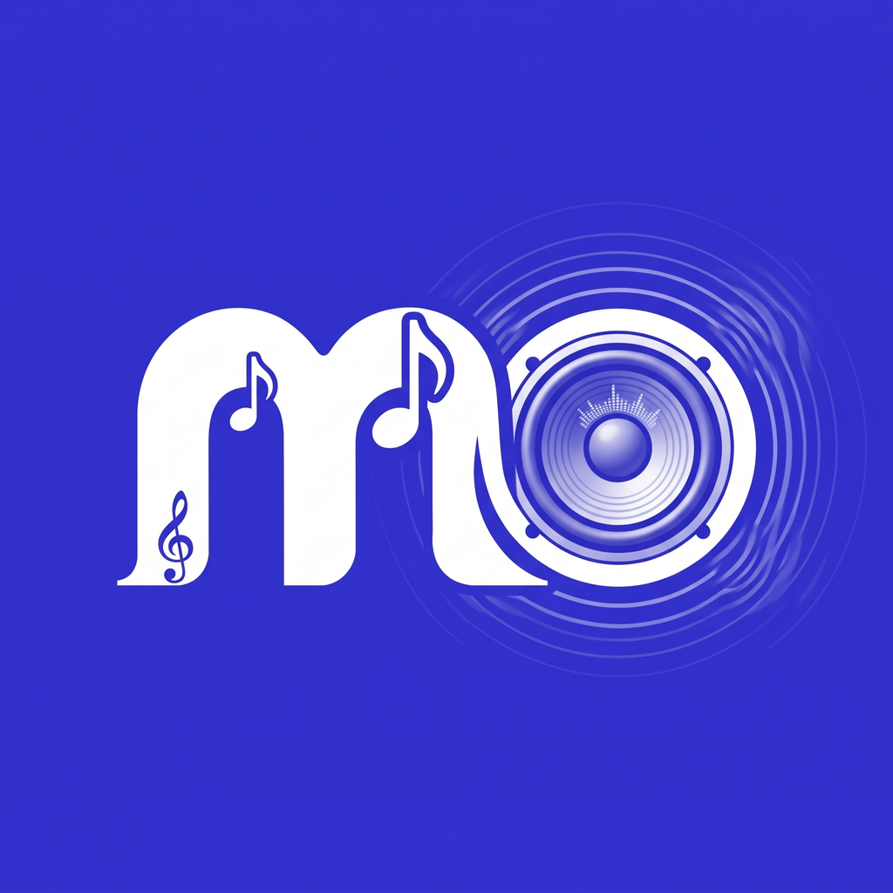

<div align="center">



<h1>Mo Music</h1>

<p><strong>مشغّل موسيقى متعدد المنصات · العربية أولًا · RTL · Flutter</strong></p>
<p><strong>Offline-first cross-platform music player · Arabic-first · Flutter</strong></p>

<p>
  <a href="https://github.com/if12is/Mo-Music/releases/latest">
    
  </a>
  <a href="https://github.com/if12is/Mo-Music/releases/latest">
    
  </a>
  <a href="LICENSE">
    
  </a>
  
</p>

<p>
  <a href="https://github.com/if12is/Mo-Music/releases/latest/download/MoMusic-android-universal.apk">
    
  </a>
  <a href="https://github.com/if12is/Mo-Music/releases/latest/download/MoMusic-windows-installer.exe">
    
  </a>
  <a href="https://github.com/if12is/Mo-Music/releases/latest/download/MoMusic-linux-x64.tar.gz">
    
  </a>
  <a href="https://github.com/if12is/Mo-Music/releases/latest/download/MoMusic-macos.zip">
    
  </a>
</p>

</div>

---

## ما هو مو ميوزك؟

**مو ميوزك** مشغّل موسيقى حديث يعمل أولًا بدون إنترنت، مع هوية بصرية جديدة ولغة عربية افتراضية واتجاه RTL.

Mo Music is a modern offline-first Flutter music player. Arabic is the default language, Cairo is the bilingual UI font, and in-app updates come from **this repository** (`if12is/Mo-Music`), not from the original upstream project.

## الهوية

- الاسم: **Mo Music** / **مو ميوزك**
- اللون: `#3332CE`
- الخط: **Cairo** (عربي + إنجليزي)
- التحديثات: `https://github.com/if12is/Mo-Music/releases`

## التحديثات والإصدارات

التطبيق يتحقق من الإصدارات عبر:

1. `UPDATE_CHECK_URL` إن وُجد في `.env`
2. `distribution/update-check.json` في هذا المستودع
3. GitHub Releases/Tags الخاصة بـ `if12is/Mo-Music`

لنشر إصدار جديد:

```bash
# 1) ارفع رقم الإصدار في pubspec.yaml مثل 2.5.0+74
# 2) ادفع التغييرات إلى dev
# 3) أنشئ tag وأصدر Release في GitHub
git tag v2.5.0
git push origin v2.5.0
```

إنشاء Release في GitHub يشغّل بناء المنصات ويرفع ملفات:

| المنصة | الملف |
|---|---|
| Android | `MoMusic-android-universal.apk` |
| Windows | `MoMusic-windows-installer.exe` |
| Linux | `MoMusic-linux-x64.tar.gz` |
| macOS | `MoMusic-macos.zip` |
| iOS | `MoMusic-ios-unsigned.ipa` |

يمكن أيضًا تشغيل workflow `Publish update manifest` لتحديث `distribution/update-check.json`.

## البناء من المصدر

```bash
git clone https://github.com/if12is/Mo-Music.git
cd Mo-Music
cp .env.example .env
flutter pub get
flutter run
```

## الترخيص

مرخّص تحت **GNU GPL v3.0**. راجع [CREDITS.md](CREDITS.md) لإقرارات المشاريع الأصلية.

Made by **Ahmed Elsayed** · [if12is/Mo-Music](https://github.com/if12is/Mo-Music)
